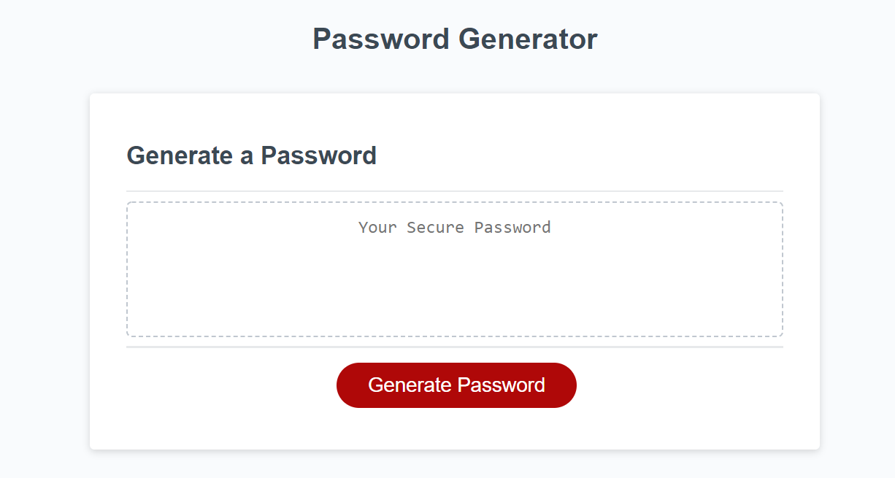
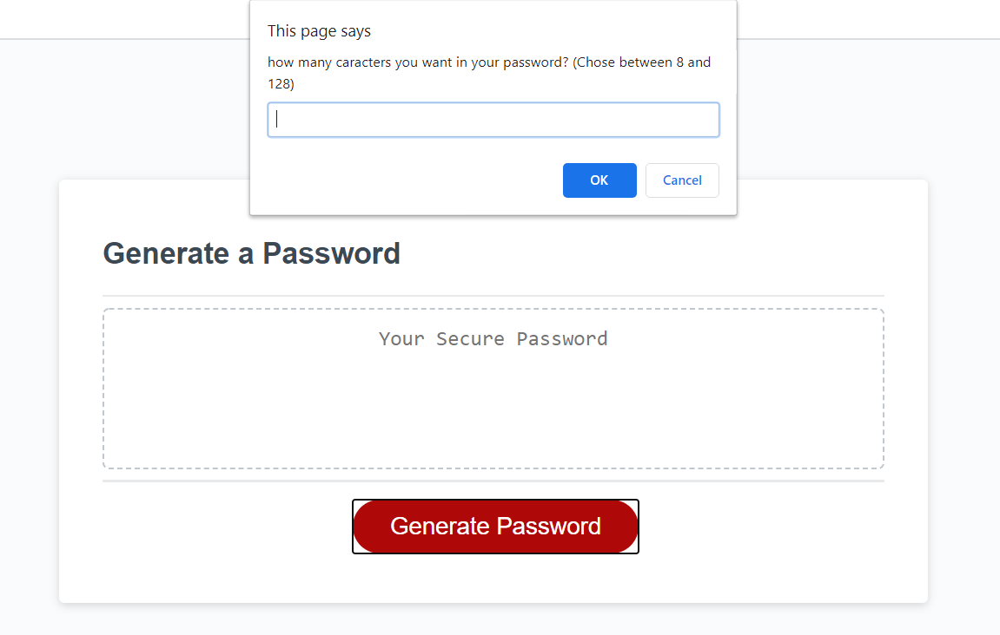
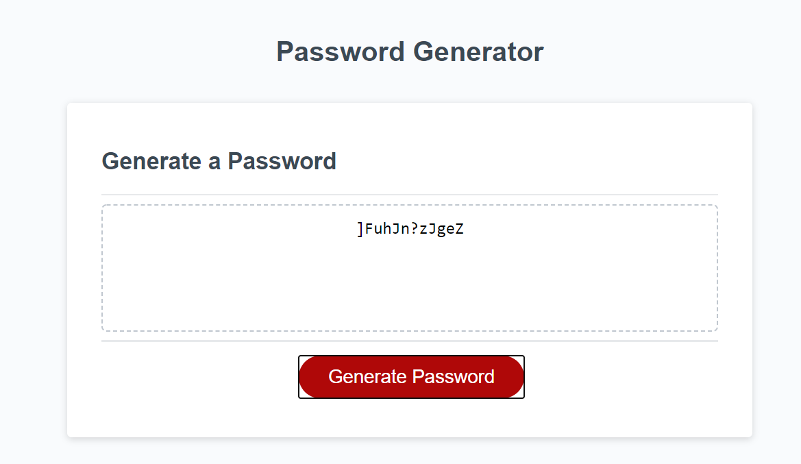

# Password-Generator

## Project Goal

Create a website that will generate random passwords withe the following criterias:

1. User will chose the length of the password between 8 and 128 characters.
2. By default the password will include lowcase characters letter.
3. user will have the choice to add to the password uppercase characters, numbers, and special characters. at least one of the 3 need to be chosen.
4. After all the choices are confirmed a password is generated on the screen.

## Link to the website

https://zpinson.github.io/Password-Generator/

## Preview images

